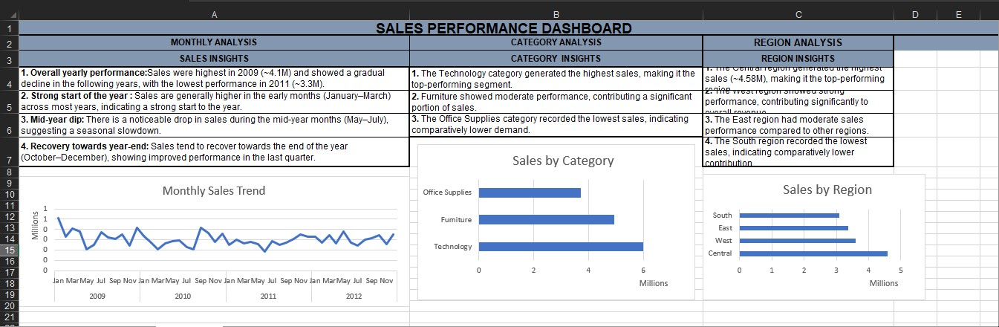

## 📊 Sales Data Analysis Dashboard (Excel)
## 📊 Dashboard Preview

### 🔹 Project Overview  
This project analyzes retail sales data using Excel to identify trends, category performance, and regional distribution. A dashboard is created to present insights clearly.

---

### 🔹 Key Analysis  
- Monthly sales trend analysis  
- Category-wise performance comparison  
- Region-wise sales analysis  

---

### 🔹 Tools Used  
- Microsoft Excel  
- Pivot Tables  
- Data Cleaning  
- Data Visualization  

---

### 🔹 Key Insights  
- Sales showed strong performance at the beginning and end of the year  
- Technology category generated the highest sales  
- Central region contributed the most to overall revenue  

---

### 📁 Files  
- `Sales_Data_Analysis_Dashboard.xlsx` - Complete dashboard
---

### ⭐ How to Use  
Download the Excel file and explore the dashboard and pivot tables.
